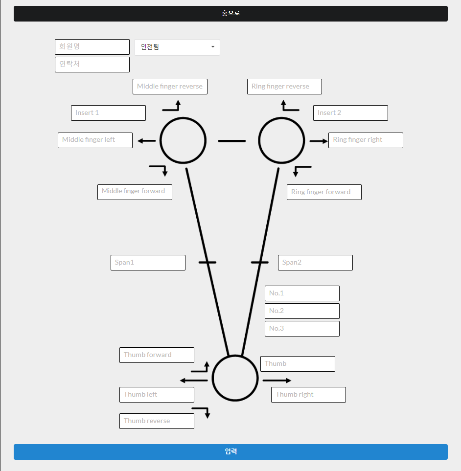
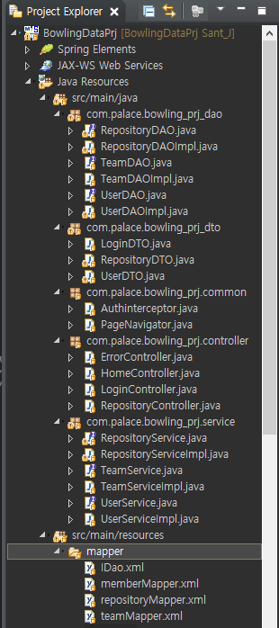

# 프로젝트 완성시 readme 파일 최 상단에 기재하겠습니다.

***

# 볼링장 지공 데이터 입력 Web App
***
JAVA / Spring 을 이용하여 구현하였고, 볼링장에서 유용하게 사용할 수 있는 지공 차트 웹 프로그램입니다.  

  
컴포넌트 구조 설명
----------

해당 컴포넌트는  
이런방식이다  
줄바꿈도 된다.  

* 해당 소스는 무료 배포 소스 입니다.
* 해당 프로그램은 다중 사용에 맞추어진 웹 프로그램입니다.
* 관련 SQL 구문은 MySqlDB_setup_query를 참고하시기 바랍니다.

